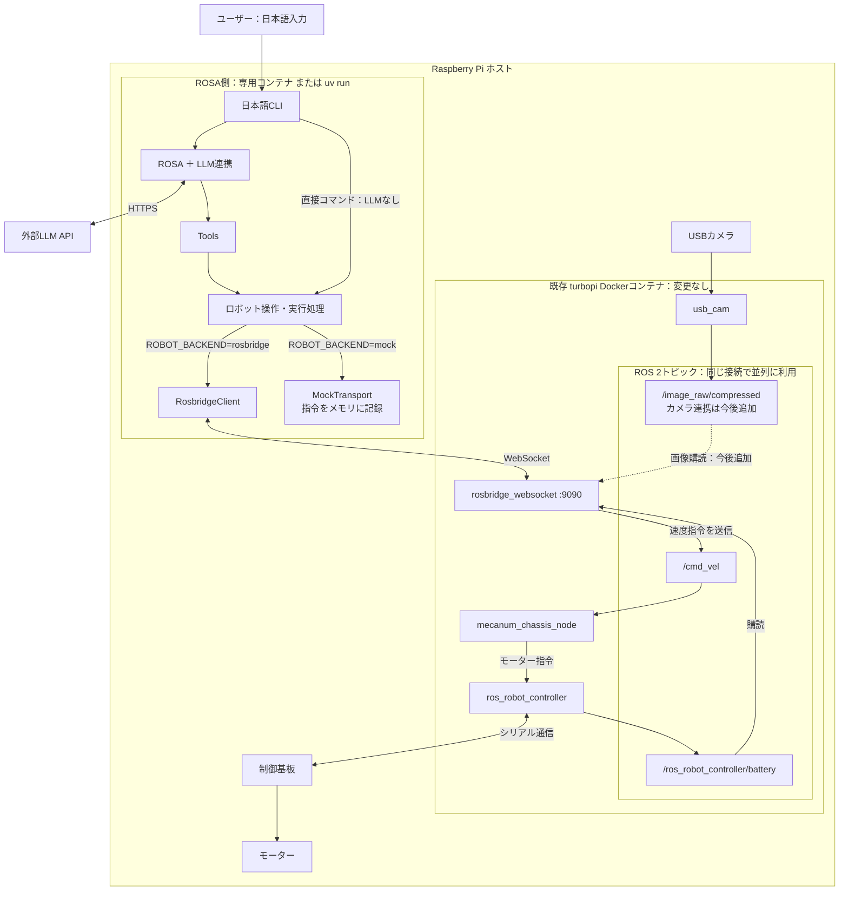

# アーキテクチャ

## 設計の軸

この実装は、自然言語を「引数と制約が決まった操作ツール」に変換し、既存TurboPiへつなぎます。LLMは操作の選択、Pythonコードは実行と制約、既存ROSは機体制御を担当します。

例えば「左に1秒移動して」は、ROSAとLLMが `move_left(duration_s=1)` に変換します。ツールは速度・時間を検証する実行処理へ渡し、実行処理が定周期で速度指令を送り、最後にゼロ速度を送ります。ツールは終了を待って結果を返し、LLMがその結果を説明します。

| 層 | 責務 |
|---|---|
| CLI | 日本語入力・結果表示・直接操作 |
| ROSA ＋ LLM | ツールの選択と引数の決定、実行結果の説明 |
| tools | 操作の意味・引数・範囲・戻り値をLLMへ提示 |
| robot | 速度・時間の検証、定周期実行、取消、終了時停止 |
| transport | rosbridge通信、またはネットワークを使わないモック |
| 既存ROS・制御基板 | 速度指令の車輪指令への変換と機体制御 |

システムプロンプトは、条件確認・順次実行・終了判断・結果に基づく報告の基本ルールに絞ります。各操作の単位・範囲・完了状態はツールのdocstringに記載し、速度・時間の制限はコードでも検証します。

## 全体構成

既存 `turbopi` コンテナを変更せず、WebSocketのrosbridgeを境界として接続します。TurboPiのソース・SDK・コンテナイメージを本リポジトリへ取り込まず、Dockerソケットもマウントしません。ROSA側は専用コンテナと `uv run` のどちらでも実行できます。

実機では各トピックを同じrosbridge接続で利用します。モックでは機体へ接続せず、指令をメモリに記録します。ただしモックの `chat` もLLM APIには接続します。カメラは既存ROS側で配信されていますが、本アプリの画像取得ツールは未実装です。

## ROSAへのツール登録

ROSA 1.0.10の標準ツールはROS CLI・rclpyやシステム操作を前提とするため、`RosbridgeROSA._get_tools` をオーバーライドして本アプリのツールだけを登録します。この内部フックへの依存は、ROSA更新時にテストで確認します。`blacklist` はツール名の許可リストではありません。

状態・バッテリーツールは両バックエンドで利用できます。モックでは移動・停止ツールも登録し、実機では `ENABLE_MOTION=true` の場合に登録します。現在の既定値は `true` で、読み取り専用には `false` を指定します。

## 実行結果と停止の範囲

MotionExecutorはバックグラウンドのワーカーで指令を送りますが、移動ツールは終了を待ち、最後のゼロ速度送信後に結果を返します。モックと実機で同じ実行処理を使い、重複移動を拒否します。

状態は `idle`、`running`、`completed`、`cancelled`、`failed` です。引数不正などの実行拒否はツールが `rejected` を返します。実機の `completed` は指令送信処理の完了であり、物理的な移動・停止をセンサーで確認した意味ではありません。

既存ROS・SDKコードには指令途絶時の停止監視が見当たらず、基板ファームウェアの挙動は未確認です。通信断やプロセス強制終了時の停止は保証できません。また、既存アプリも `/cmd_vel` に指令を出し得るため、実機では操作元の競合に注意が必要です。

## CLIと検証

`/status` と `/stop`、CLIの直接コマンドはLLMを経由しません。移動実行・LLM応答待ちの間は次のチャット入力を処理できません。終了時は移動の停止を試みてから接続を閉じます。

チャット中は速度指令の定周期ログを出さず、入力プロンプトを保ちます。モックの `move` コマンドでは指令ログと最終状態を表示します。

テストは通信モック・仮想時計・テスト用LLMで、ツールの選択経路、速度・時間制限、停止、エラー、完了結果を検証します。実機や外部LLM APIには接続しません。
